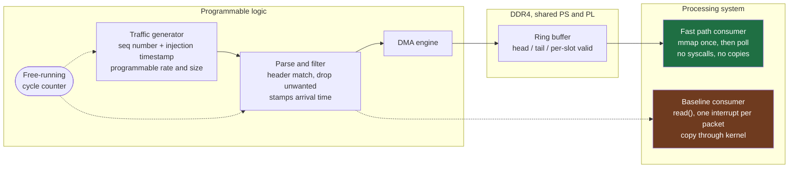

# Kernel-Bypass-Ingest

A kernel-bypass packet ingestion path on a Zynq UltraScale+ MPSoC, with an
ordinary interrupt-driven path built beside it so the comparison means something.

> **Status: In progress (M0 of M7).**
> No latency or throughput figure appears anywhere in this repository. See
> [Measurement policy](#measurement-policy).

## What this is

A receive path that gets packets from programmable logic into a userspace process
without the kernel in the loop. In the steady state the consumer performs no
syscalls, no copies, and takes no interrupts per packet: it maps a DDR4 ring once
and then polls it.

Built alongside it, from the same traffic source, is a conventional
interrupt-per-packet, copy-through path where userspace calls `read()`. That
baseline is the point. A bypass number with nothing beside it proves nothing.

## Why traffic is generated in fabric

The AUP-ZU3 has no Ethernet, no PCIe, no SFP and no camera. Traffic is therefore
generated inside the programmable logic. That is a constraint of the board, and
it is also what makes the latency measurement trustworthy: the injection
timestamp is taken from the same free-running fabric counter that the consumer's
arrival time is measured against, so the figure never crosses a clock domain.

Latency is measured in fabric clock cycles. Conversion to time happens only at
reporting.

## Block diagram



The dotted path into the baseline consumer is the interrupt-driven comparison
path. It is fed by the same generator so that both paths see identical traffic.

## Milestones

| | Milestone | State |
|---|---|---|
| **M0** | Board bring-up: Vivado project, Linux on the PS, PL blink, repeatable rebuild | **In progress** |
| M1 | Packet generator in fabric, verified in a SystemVerilog testbench | Not started |
| M2 | AXI DMA writing into DDR4, bytes proven from Linux | Not started |
| M3 | Ring buffer discipline: head, tail, wraparound, valid marker written last | Not started |
| M4 | Userspace poll consumer, no syscalls in steady state | Not started |
| M5 | Parse and filter stage in hardware | Not started |
| M6 | Interrupt-driven copy-through baseline | Not started |
| M7 | Measurement harness: latency histogram, both paths, throughput to drop | Not started |

Each milestone has to work before the next one starts.

## Known hard parts

Flagged early, resolved at the milestone named.

- **Cache coherence (M2).** A PL write into DDR4 is not automatically visible to
  the PS caches. The options are the I/O coherent HPC ports through the CCI, a
  non-cacheable mapping, or explicit invalidation. Getting this wrong produces
  stale reads that look like a logic bug. The decision is made deliberately at
  M2, with the trade-off written down, not discovered at M4.
- **Reserved memory (M3).** Linux must not allocate over the ring. That is a
  device tree `reserved-memory` node.
- **Memory ordering (M3).** The per-slot valid marker has to become visible to
  the consumer strictly after the payload it describes, never before.
- **Two clock domains (throughout).** The fabric counter and anything on the PS
  side are separate. Every latency figure stays in fabric cycles until reporting.

## Measurement policy

This project exists to produce a trustworthy number, so the rules about numbers
are strict.

1. No latency or throughput figure is stated anywhere until it has been measured
   on this hardware. Not as an estimate, not as a typical value, not as a
   placeholder.
2. No bypass figure is quoted until the interrupt-driven baseline exists and is
   measured beside it.
3. The measurement harness and the raw data are committed here, not just a
   summary.

## Hardware

RealDigital AUP-ZU3. Zynq UltraScale+ XCZU3EG in SFVC784, 8 GB DDR4 reachable by
both the processing system and the programmable logic.

Board files and reference designs come from
[RealDigitalOrg/aup-zu3-bsp](https://github.com/RealDigitalOrg/aup-zu3-bsp).

## Repository layout

```
docs/         findings per milestone, written as they land
hw/           SystemVerilog sources
hw/tb/        testbenches, written before the RTL they exercise
hw/scripts/   Tcl to regenerate the Vivado project from source
sw/           userspace consumers, fast path and baseline
meas/         measurement harness and raw data
```

The Vivado `.xpr` is deliberately not committed. `hw/scripts/` regenerates the
project, so the source of truth stays readable in git.
